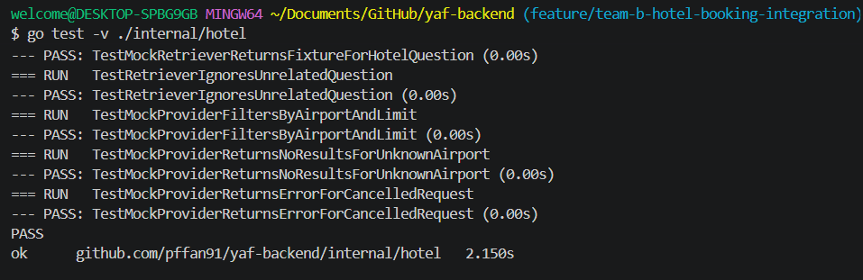
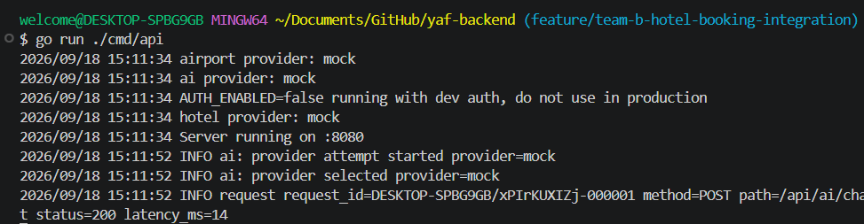
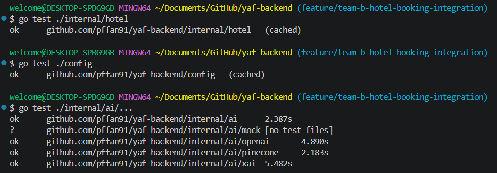

# Hotel/Booking Provider Preparation

## Task
Investigate and prepare a hotel or booking data provider for chatbot integration. 

## Current provider status
The client has not yet confirmed the hotel or booking provider. API credentials, sandbox access, and official integration documentation are still pending. A provider-neutral hotel interface and a local mock provider have been prepared.

The fixture contains fictional records for development and testing only. Not real booking data and not used for production bookings.

## Response structure reviewed
The YAF hotel model includes:
- Provider and provider ID
- Airport IATA code
- Hotel name and address
- Distance from the airport
- Accessibility features
- Evidence status for each accessibility feature
- Price and currency
- Availability
- Booking URL
- Source URL
- Retrieval timestamp

Accessibility fields include:
- Step-free entrance
- Wheelchair-accessible room
- Roll-in shower
- Accessible toilet
- Grab rails
- Emergency call cord
- Accessible parking
- Accessible airport shuttle

## Local integration and testing
The local mock provider is wired into the AI retrieval flow when `HOTEL_PROVIDER=mock` is configured. Hotel data can be loaded, filtered by airport code, limited by result count, and returned as retrieval context.

Tests performed:

```text
go test ./internal/hotel
go test ./config
```

### Hotel mock provider tests


*Figure 1: Detailed hotel test results covering hotel questions, unrelated questions, airport and result-limit filtering, unknown airports, and cancelled requests.*

### Local backend running



*Figure 2: The backend running on port 8080 with mock providers and development authentication. The request log shows an HTTP 200 response.*

### Related package tests


*Figure 3: Hotel and configuration tests passing with cached results, alongside passing AI package tests.*

## Blockers and provider limitations
The following items are blocking real provider integration:
- The client has not confirmed the selected hotel or booking provider.
- No official API documentation or sandbox endpoint has been supplied.
- API credentials and authentication details are unavailable.
- Booking and availability request formats are unknown.
- Provider accessibility fields and evidence standards are not confirmed.
- A real connectivity test cannot be completed until sandbox access is provided.
